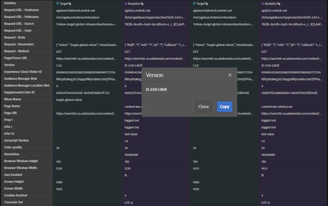

# Netwerkinformatie{#network-information}

Klik op **[!UICONTROL Network]** om netwerkinformatie weer te geven.

Het scherm van het Netwerk aggregeert alle de oplossingsvraag van Adobe Experience Cloud die op de pagina wordt gemaakt en toont hen in orde van links naar rechts. Standaardparameters worden automatisch geëtiketteerd met vriendelijke namen en gerangschikt om gemeenschappelijke parameters op dezelfde rol te groeperen.

>[!TIP]
>
>Dit scherm is nuttig om te bevestigen dat de parameters die voor integratie worden gebruikt, zoals identiteitskaart van de Bezoeker van de Experience Cloud of Supplementale identiteitskaart van Gegevens, over integraties verenigbaar zijn.

>[!NOTE]
>
>Op dit ogenblik, zijn niet alle parameters die in de oplossingsvraag worden overgegaan (bijvoorbeeld, de contextvariabelen van Analytics, de douaneparameters van het Doel, of de Klant IDs van de Dienst van Experience Cloud ID) zichtbaar in het scherm van het Netwerk.

Selecteer **[!UICONTROL All]**.

U kunt de informatie ook filteren op oplossing. Selecteer de oplossingen die u wilt bekijken. U kunt meerdere oplossingen tegelijkertijd bekijken. De geselecteerde oplossingsfilters worden gemarkeerd.

Klik op een punt in de mening van het Netwerk om het groter te zien. Vanuit het uitgevouwen weergavevenster kunt u de weergegeven informatie naar het klembord kopiëren.

Gebruik het pictogram boven aan elke kolom om de URL van de serveraanroep naar het klembord te kopiëren, waar u deze ter referentie of voor foutopsporing in een ander document kunt plakken.

