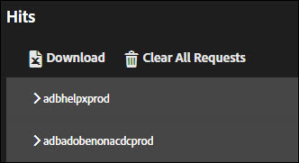

# Tabs Oplossing{#solution-tabs}

Klik op de tabbladen van de oplossing om de resultaten voor specifieke Adobe Experience Cloud-oplossingen te bekijken.

## Analytics {#section-f71dfcc22bb44c86bec328491606a482}

Het tabblad Analyse bevat informatie over de implementatie van [Analytics](https://docs.adobe.com/content/help/nl-NL/analytics/landing/home.html) .

**Hits**

Door gebrek, worden alle servervraag die aan de zelfde rapportreeks wordt gemaakt doen ineenstorten.

**Downloaden:** Download informatie over alle getoonde rapportsuites als een Excel-spreadsheet.

**Alle aanvragen wissen:** Verwijder alle weergegeven aanvragen uit de Analytics-weergave. Nadat u de aanvragen hebt verwijderd, worden nieuwe aanvragen weergegeven wanneer ze zich voordoen.

Klik op de rapportsuite-id om de weergave uit te vouwen:

In dit scherm worden alle aanvragen weergegeven sinds Foutopsporing op het Adobe Experience Platform is geopend of de aanvragen zijn gewist. Standaardparameters worden automatisch toegewezen aan vriendelijke namen. [Variabelen Prop en eVar](https://docs.adobe.com/content/help/nl-NL/analytics/implementation/vars/page-vars/evar.html) kunnen worden toegewezen aan uw aangepaste vriendelijke namen (bijvoorbeeld &#39;prop1&#39; kan worden weergegeven als &#39;Type gebruiker&#39;) als u verifieert met de functie &#39;Analytics koppelen&#39; (zie hieronder). Verzoeken worden op volgorde van links naar rechts weergegeven.

**Downloaden:** Sla alle aanvragen voor de rapportsuite op als Excel-spreadsheet.

**Aanvragen wissen:** Verwijder alle aanvragen die aan deze rapportsuite zijn gedaan. Nieuwe aanvragen worden weergegeven wanneer ze zich voordoen.

**Gekoppelde accounts (verouderd)**

Klik **[!UICONTROL Link Account]**, ga dan de gevraagde informatie in om een rekening van de Analyse aan Foutopsporing van het Platform te verbinden.

>[!NOTE]
>
>Deze functie wordt momenteel alleen ondersteund voor aanmeldingsgegevens van oudere Analytics-gebruikers.

**Nabewerkte Hits ophalen**

Schakel de optie Nabewerkte its ophalen in als u de waarden van Analytics-resultaten wilt zien nadat de verwerkingsregels zijn uitgevoerd. Deze functie werkt alleen als u bent aangemeld bij Adobe Experience Cloud.

Wanneer deze optie wordt toegelaten, wordt een het zuiveren parameter toegevoegd aan uw verzoeken van Analytics. Hits worden nog steeds verwerkt als andere treffers. Foutopsporing van Platform opinieert de API voor foutopsporing van Analytics om waarden op te halen uit de naverwerkingsregels voor alle resultaten die een originele Hit-id hebben. Vervolgens verwerkte treffers hebben een paarse achtergrond en worden weergegeven naast de originele treffer.

Voor de meeste analytische implementaties is de informatie over de naverwerkingsregels binnen een paar minuten beschikbaar. Analyses voor de implementatie van Target (A4T) duren aanzienlijk langer.

## Target {#section-988873ba5ede4317953193bd7ac5474c}

Gebruik het lusje van het Doel om de [verzoeken van het Doel](https://docs.adobe.com/content/help/en/target/using/target-home.html) of [Mbox de reactiedetails van het Spoor](https://docs.adobe.com/content/help/en/target/using/activities/troubleshoot-activities/content-trouble.html) te bekijken.

Klik **[!UICONTROL Requests]** en vouw de omgeving uit om informatie over Doel weer te geven.

Klik **[!UICONTROL Clear All Requests]** om de momenteel getoonde verzoeken te verwijderen. Er zullen meer verzoeken verschijnen zoals ze worden gedaan.

U kunt het filter van het Doel ook gebruiken om het Spoor van MBox voor de Foutopsporingsdoeleinden [van het Doel](https://docs.adobe.com/content/help/en/target/using/activities/troubleshoot-activities/content-trouble.html)toe te laten.

U moet een open lusje van het Chroom hebben dat in de Experience Cloud voor authentiek wordt verklaard om Mbox Spoor toe te laten. Zodra toegelaten, toont het uw Adobe identiteitskaart gebruikersnaam. Vouw uw gebruikersnaam uit om de doelclientcodes beschikbaar te maken die zijn gekoppeld aan de Experience Cloud-organisaties waartoe u toegang hebt. Klik op de clientcode waarvoor u Mbox Trace wilt inschakelen en bevestig dat het groene vinkje wordt weergegeven. Alle verzoeken van het Doel met de informatie van het Spoor Mbox zullen nu verschijnen, gegroepeerd door cliëntcode. Om de informatie van het Spoor te onderzoeken Mbox, breid het verzoek uit om de lusjes te zien:

* [Activiteiten](https://docs.adobe.com/content/help/en/target/using/activities/activities.html) Op het tabblad Activiteiten worden alle activiteiten weergegeven die aan de naam van het doelverzoek zijn gekoppeld, ongeacht of u voor de activiteit in aanmerking kwam. &quot;Gelijktijdige activiteiten&quot; zijn de activiteiten waarvoor u in aanmerking kwam en waarvoor in het antwoord voorstellen zijn gedaan. U kunt de naam van de activiteit uitbreiden om de ervaring te bevestigen u binnen bent en welke publiek en het richten voorwaarden u voor de activiteit kwalificeerden. De &quot;geëvalueerde Activiteiten&quot;zijn alle beoordeelde activiteiten, ongeacht of u kwalificeerde. Om problemen op te lossen waarom u niet in aanmerking komt voor een activiteit die &quot;Evaluated&quot;maar niet &quot;Matched&quot;was, breid de activiteitennaam uit en herzie de &quot;Niet bij elkaar passende sectie van het publiek&quot;.

* Verzoek

   Het aanvraagtabblad van [Mbox Trace](https://docs.adobe.com/content/help/en/target/using/activities/troubleshoot-activities/content-trouble.html) is vergelijkbaar met het hoofdaanvraagtabblad. U kunt alle parameters bekijken die door het verzoek van het Doel, naast de verzoekkopballen worden overgegaan.
* Profiel

   Vouw de sectie Profielmomentopname uit om [profielgegevens](https://docs.adobe.com/content/help/en/target/using/audiences/visitor-profiles/variables-profiles-parameters-methods.html) weer te geven die als bezoeker over u zijn opgeslagen in de doelprofieldatabase. Alle in-mbox- en scriptprofielen worden hier weergegeven, evenals enkele systeemprofielen. In de kolom Status wordt aangegeven welke profielen binnen het bereik van deze aanvraag zijn gewijzigd, plus de waarden ervan vóór en na de aanvraag die in het profielsysteem is ingevoerd.
* Audience Manager

   De &quot;segmentIds&quot;en &quot;cachedSegmentIds&quot;secties van het lusje van de Audience Manager stellen identiteitskaarts van [publiek](https://docs.adobe.com/content/help/en/target/using/audiences/target.html) bloot dat van de Experience Cloud aan Doel wordt gedeeld, en waarvoor u gekwalificeerd hebt. Dit zou publiek kunnen zijn dat in Audience Manager, Analytics, of de Bouwer van de Publiek in de Dienst van de Kern van Mensen wordt gecreeerd. Deze id&#39;s kunnen worden opgezocht in de gebruikersinterface van de Audience Manager om de publieksnaam te zoeken.

De volgende video toont de algemene functionaliteit van het Doel:

>[!VIDEO](https://video.tv.adobe.com/v/23115t2/)

In de volgende video ziet u Mbox-overtrek:

>[!VIDEO](https://video.tv.adobe.com/v/23113t2/)

## Audience Manager {#section-1d4484f8b46f457f859ba88039a9a585}

Gebruik het tabblad [Audience Manager](https://docs.adobe.com/content/help/en/audience-manager/user-guide/aam-home.html) om details van [gebeurtenissen](https://docs.adobe.com/content/help/en/audience-manager/user-guide/api-and-sdk-code/dcs/dcs-event-calls/dcs-event-calls.html)weer te geven. Klik op de organisatie om deze uit te vouwen en de informatie weer te geven.

Klik **[!UICONTROL Clear All Events]** om de weergegeven informatie opnieuw in te stellen. Nieuwe gebeurtenissen worden weergegeven zoals ze zich voordoen.

**ID-synchronisatie**

De synchronisatie van identiteitskaart is de eerste stap in het binnenkomende, asynchrone proces van de gegevensoverdracht. In deze stap vergelijken Audience Manager en leverancier ID&#39;s voor hun respectievelijke sitebezoekers en komen deze overeen.

Zie Synchronisatie van [identiteitskaart voor Binnenkomende Overdrachten](https://docs.adobe.com/content/help/en/audience-manager/user-guide/implementation-integration-guides/sending-audience-data/batch-data-transfer-process/id-sync-http.html) van Gegevens in de Documentatie van het Product van de Audience Manager voor meer informatie.

## Advertising Cloud {#section-ee80a9c509f2462c89c1e5bd8d05d7c8}

Op het tabblad Advertising Cloud kunt u Advertising Cloud-verzoeken weergeven.

Klik **[!UICONTROL Requests]** en vouw de omgeving uit om informatie over Advertising Cloud weer te geven.

Klik **[!UICONTROL Clear All Requests]** om de momenteel getoonde verzoeken te verwijderen. Er zullen meer verzoeken verschijnen zoals ze worden gedaan.

## Experience Cloud ID-service {#section-a96c32f8e63a4991abb296f6e8ea01cf}

Gebruik het lusje van de Dienst van identiteitskaart van Experience Cloud om de verzoeken van de Dienst [van](https://docs.adobe.com/content/help/nl-NL/id-service/using/home.html) Experience Cloud te bekijken.

Klik **[!UICONTROL Requests]**, breid dan het milieu uit om informatie over de Dienst van identiteitskaart van Experience Cloud te bekijken.

Klik **[!UICONTROL Clear All Requests]** om de momenteel getoonde verzoeken te verwijderen. Er zullen meer verzoeken verschijnen zoals ze worden gedaan.
