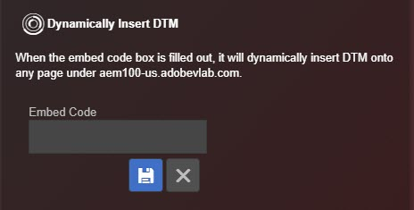

# Gereedschappen{#tools}

Op het scherm van Hulpmiddelen, kunt u diverse hulpmiddelen voor de geïnstalleerde oplossing toelaten of onbruikbaar maken. U kunt bijvoorbeeld de foutopsporingsinstructies voor de console van Target inschakelen of de DTM Staging Library gebruiken. Deze gereedschappen zijn alleen beschikbaar als Target en DTM op de pagina zijn geïnstalleerd.

U kunt Launch of DTM dynamisch invoegen op elke pagina om iets te testen op een pagina waarop Launch of DTM niet is geïnstalleerd. Klik op het **[!UICONTROL Embed Code]** pictogram, typ de [insluitcode](https://experiencecloud.adobe.com/resources/help/en_US/dtm/deployment.html) en klik op **[!UICONTROL Save]**.

## DTM-informatie {#section-c3d43040440449e5a050170843a600b7}

<table id="table_04625C3319134E169A35DB74C1D1FB31"> 
 <thead> 
  <tr> 
   <th colname="col1" class="entry"> Gereedschap </th> 
   <th colname="col2" class="entry"> Beschrijving </th> 
  </tr>
 </thead>
 <tbody> 
  <tr> 
   <td colname="col1"> 
 Logboekregistratie DTM-console 
 </td> 
   <td colname="col2"> 
Dit hulpmiddel stelt DTM-specifieke het zuiveren verklaringen aan de browser console bloot. 
 </td> 
  </tr> 
  <tr> 
   <td colname="col1"> 
Staging-bibliotheek gebruiken 
 </td> 
   <td colname="col2"> 
Dit hulpmiddel gebruikt de Staging bibliotheek voor DTM het zuiveren informatie. 
 </td> 
  </tr> 
  <tr> 
   <td colname="col1"> 
DTM uitschakelen 
 </td> 
   <td colname="col2"> 
Met dit gereedschap wordt voorkomen dat DTM-informatie wordt gecontroleerd. 
 </td> 
  </tr> 
  <tr> 
   <td colname="col1"> 
 DTM dynamisch invoegen 
 </td> 
   <td colname="col2"> 
 Met dit gereedschap wordt DTM-code op de pagina ingevoegd. Gebruik de Ingebedde redacteur van de Code om de code uit te geven die wordt opgenomen. 
 </td> 
  </tr> 
 </tbody> 
</table>

## Doelgegevens {#section-31090d95f50e455692b672c26e6a2051}

<table id="table_A71D269B49F4417599EBACA44D5CCF4F"> 
 <thead> 
  <tr> 
   <th colname="col1" class="entry"> Gereedschap </th> 
   <th colname="col2" class="entry"> Beschrijving </th> 
  </tr>
 </thead>
 <tbody> 
  <tr> 
   <td colname="col1"> 
Logboekregistratie doelconsole 
 </td> 
   <td colname="col2"> 
Dit hulpmiddel stelt doel-specifieke het zuiveren verklaringen aan de browser console, allen die met  AT beginnen bloot: door een cookie met de naam  mboxDebug=true aan uw browser toe te voegen. Op dit ogenblik, verschijnen de consoleverklaringen niet binnen het Debugger Logs scherm, maar zijn zichtbaar in de browser inheemse het zuiveren console. 
 
 Voor dit gereedschap is 0.js 0.9.6+ vereist. Als u een oudere versie van at.js gebruikt, kunt u de parameter van het  ?mboxDebug=true vraagkoord aan uw URL toevoegen om consoleregistratie aan te zetten. Als u mbox.js gebruikt, kunt u de parameter toevoegen  ?_AT_Debug=console om consoleregistratie aan te zetten die tot de activiteiten van Composer van de Visuele Ervaring wordt beperkt. 
 </td> 
  </tr> 
  <tr> 
   <td colname="col1"> 
 Mbox-sporen inschakelen 
 </td> 
   <td colname="col2"> 
Dit hulpmiddel voegt gedetailleerde informatie aan de Reacties van het Doel toe, die in het  Doel&gt;scherm van het Spoor van het Debugger kan worden onderzocht. 
 
 U moet op een van uw tabbladen voor Chrome zijn aangemeld bij de Experience Cloud om dit gereedschap in te schakelen. 
 </td> 
  </tr> 
  <tr> 
   <td colname="col1"> 
Doel uitschakelen 
 </td> 
   <td colname="col2"> 
Dit hulpmiddel maakt alle verzoeken van het Doel onbruikbaar door een koekje genoemd  mboxDisable=true aan uw browser toe te voegen. 
 
 Voor dit gereedschap is 0.js 0.9.6+ vereist. Als u een oudere versie gebruikt, kunt u de parameter van het  ?mboxDisable=true vraagkoord aan uw URL toevoegen om dozen onbruikbaar te maken. 
 </td> 
  </tr> 
  <tr> 
   <td colname="col1"> 
 Mbox Highlight 
 </td> 
   <td colname="col2"> 
 Met dit gereedschap tekent u een rood kader rond verouderde, omloopstijlvakken. 
 </td> 
  </tr> 
 </tbody> 
</table>

In de volgende video wordt uitgelegd hoe u de extensie Foutopsporing kunt gebruiken met Adobe Target.

>[!VIDEO](https://video.tv.adobe.com/v/23115t2/)
