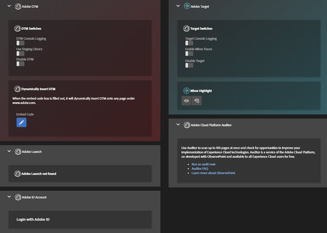

# Tools{#tools}

Op het scherm van Hulpmiddelen, kunt u diverse hulpmiddelen voor de geïnstalleerde oplossing toelaten of onbruikbaar maken. U kunt bijvoorbeeld de foutopsporingsinstructies voor de console van Target inschakelen of de DTM Staging Library gebruiken. Deze gereedschappen zijn alleen beschikbaar als Target en DTM op de pagina zijn geïnstalleerd.

U kunt Adobe Experience Platform Launch of DTM dynamisch op elke pagina invoegen om iets te testen op een pagina waarop geen Platform launch of DTM is geïnstalleerd. Klik op de knop **[!UICONTROL Embed Code]** pictogram, dan typ uw [code insluiten](https://docs.adobe.com/content/help/en/dtm/using/client-side/deployment.html) en klik op **[!UICONTROL Save]**.

## DTM-informatie {#section-c3d43040440449e5a050170843a600b7}

<table id="table_04625C3319134E169A35DB74C1D1FB31"> 
 <thead> 
  <tr> 
   <th colname="col1" class="entry"> Gereedschap </th> 
   <th colname="col2" class="entry"> Beschrijving </th> 
  </tr>
 </thead>
 <tbody> 
  <tr> 
   <td colname="col1"> 
 Logboekregistratie DTM-console 
 </td> 
   <td colname="col2"> 
Dit hulpmiddel stelt DTM-specifieke het zuiveren verklaringen aan de browser console bloot. 
 </td> 
  </tr> 
  <tr> 
   <td colname="col1"> 
Staging-bibliotheek gebruiken 
 </td> 
   <td colname="col2"> 
Dit hulpmiddel gebruikt de Staging bibliotheek voor DTM het zuiveren informatie. 
 </td> 
  </tr> 
  <tr> 
   <td colname="col1"> 
DTM uitschakelen 
 </td> 
   <td colname="col2"> 
Met dit gereedschap wordt voorkomen dat DTM-informatie wordt gecontroleerd. 
 </td> 
  </tr> 
  <tr> 
   <td colname="col1"> 
 DTM dynamisch invoegen 
 </td> 
   <td colname="col2"> 
 Met dit gereedschap wordt DTM-code op de pagina ingevoegd. Gebruik de Ingebedde redacteur van de Code om de code uit te geven die wordt opgenomen. 
 </td> 
  </tr> 
 </tbody> 
</table>

## Doelgegevens {#section-31090d95f50e455692b672c26e6a2051}

<table id="table_A71D269B49F4417599EBACA44D5CCF4F"> 
 <thead> 
  <tr> 
   <th colname="col1" class="entry"> Gereedschap </th> 
   <th colname="col2" class="entry"> Beschrijving </th> 
  </tr>
 </thead>
 <tbody> 
  <tr> 
   <td colname="col1"> 
Logboekregistratie doelconsole 
 </td> 
   <td colname="col2"> 
Dit hulpmiddel stelt doel-specifieke het zuiveren verklaringen aan de browser console bloot, allen die met het beginnen van  AT: prefix, door een geroepen koekje toe te voegen  mboxDebug=true naar uw browser. Op dit ogenblik, verschijnen de consoleverklaringen niet binnen het Debugger Logs scherm, maar zijn zichtbaar in de browser inheemse het zuiveren console. 
 
 Voor dit gereedschap is 0.js 0.9.6+ vereist. Als u een oudere versie van at.js gebruikt, kunt u toevoegen  ?mboxDebug=true de parameter van het vraagkoord aan uw URL om consoleregistratie aan te zetten. Als u mbox.js gebruikt, kunt u toevoegen  ?_AT_Debug=console parameter om consoleregistratie aan te zetten beperkt tot de activiteiten van Visual Experience Composer. 
 </td> 
  </tr> 
  <tr> 
   <td colname="col1"> 
 Mbox-sporen inschakelen 
 </td> 
   <td colname="col2"> 
Dit hulpmiddel voegt gedetailleerde informatie aan de Reacties van het Doel toe, die in  Doel&gt;Mbox-overtrek scherm van debugger. 
 
 U moet op een van uw tabbladen van Chrome zijn aangemeld bij de Experience Cloud om dit gereedschap in te schakelen. 
 </td> 
  </tr> 
  <tr> 
   <td colname="col1"> 
Doel uitschakelen 
 </td> 
   <td colname="col2"> 
Dit hulpmiddel maakt alle verzoeken van het Doel onbruikbaar door een koekje toe te voegen genoemd  mboxDisable=true naar uw browser. 
 
 Voor dit gereedschap is 0.js 0.9.6+ vereist. Als u een oudere versie gebruikt, kunt u de opdracht  ?mboxDisable=true de parameter van het vraagkoord aan uw URL om dozen onbruikbaar te maken. 
 </td> 
  </tr> 
  <tr> 
   <td colname="col1"> 
 Mbox Highlight 
 </td> 
   <td colname="col2"> 
 Met dit gereedschap tekent u een rood kader rond verouderde, omloopstijlvakken. 
 </td> 
  </tr> 
 </tbody> 
</table>

In de volgende video wordt uitgelegd hoe u de extensie Foutopsporing kunt gebruiken met Adobe Target.

>[!VIDEO](https://video.tv.adobe.com/v/23115t2/)
