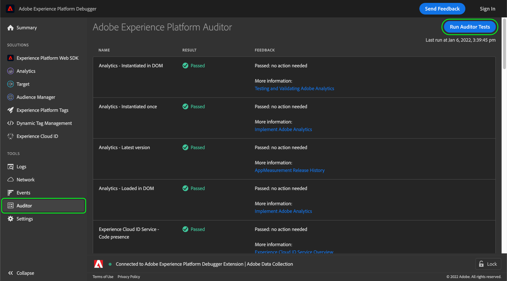

# Auditor

>[!IMPORTANT]
>
>Adobe Experience Platform Debugger bevindt zich momenteel in bèta. De documentatie en de functionaliteit kunnen worden gewijzigd.

In Adobe Experience Platform Debugger kunt u de opdracht **[!UICONTROL Auditor]** om een reeks controletests op uw pagina uit te voeren.

Deze functie gebruiken:

1. Selecteren **[!UICONTROL Auditor]** in de linkernavigatie.
1. Selecteer **[!UICONTROL Run Auditor Tests]**. Zodra de tests zijn voltooid, worden de resultaten hieronder weergegeven.

In de resultatenlijst worden de test en het resultaat weergegeven en staan suggesties om eventuele problemen op te lossen.
