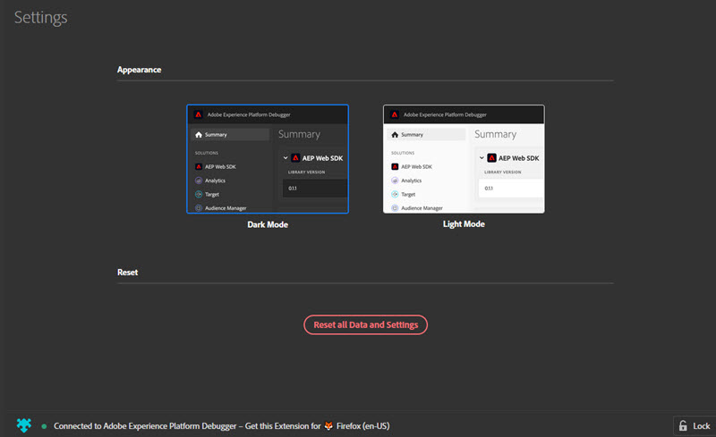

# Foutopsporing configureren

>[!IMPORTANT]
>
>Adobe Experience Cloud Debugger 2.0 is momenteel in bèta. De documentatie en de functionaliteit kunnen worden gewijzigd.

U kunt bepaalde aspecten van vormen hoe Debugger kijkt en werkt.

## Licht of donker

Nadat Foutopsporing wordt geopend, kunt u de gewenste weergave selecteren door naar ****de **Donkere modus**(standaard) of de **Lichtmodus**te gaan.

## Herstellen

Klik **[!UI CONTROL terugstellen alle Gegevens en Montages]** om alle gegevens te ontruimen en aan de standaardmontages terug te keren.

## Foutopsporing op één pagina vergrendelen

Terwijl u pagina&#39;s op uw site wijzigt, wordt het venster Foutopsporing bijgewerkt en worden de gegevens voor die pagina weergegeven. De naam van de pagina waarmee u verbinding hebt, wordt onder in het scherm weergegeven. Als u Foutopsporing op één pagina vergrendeld wilt houden, klikt u **[!UICONTROL Lock]** in de rechteronderhoek van het venster Foutopsporing.

Dit is handig als u documentatie leest of informatie op een andere pagina bekijkt tijdens het opsporen van fouten in uw pagina.