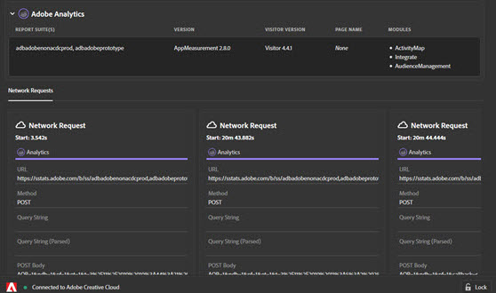

# Netwerkinformatie{#network-information}

Klik op **[!UICONTROL Network]** om netwerkinformatie weer te geven.

Het scherm van het Netwerk verenigt alle de oplossingsvraag van de Wolk van de Ervaring van Adobe die op de pagina wordt gemaakt en toont hen in orde van links naar rechts. Standaardparameters worden automatisch geëtiketteerd met vriendelijke namen en gerangschikt om gemeenschappelijke parameters op dezelfde rol te groeperen.

Dit scherm is nuttig om zeer belangrijke waardeparen over klappen te vergelijken. U kunt bevestigen dat parameters die voor integratie worden gebruikt, zoals de Experience Cloud Visitor-id of de Supplemental Data ID, consistent zijn in alle integraties.

>[!NOTE]
>
>Op dit ogenblik, zijn niet alle parameters die in de oplossingsvraag worden overgegaan (bijvoorbeeld, de contextvariabelen van de Analyse, de douaneparameters van het Doel, of de Klant IDs van de Dienst van de Wolk van de Ervaring Cloud) zichtbaar in het scherm van het Netwerk.

Om de informatie door oplossing te filtreren, selecteer de oplossing u van de lijst in linkernav wilt bekijken. In het volgende voorbeeld wordt alleen Analytics weergegeven:

Klik op **[!UICONTROL Network]**

Klik op een item in de netwerkweergave om een uitgebreide weergave te zien. Vanuit het uitgevouwen weergavevenster kunt u de weergegeven informatie naar het klembord kopiëren.

<!--Use the icon at the top of each column to copy the server call URL to your clipboard, where you can paste it into another document for reference or debugging purposes.

-->

Als u de lijst wilt wissen, klikt u op **[!UICONTROL Remove Events]**.

Als u een Excel-bestand met de informatie op dit scherm wilt downloaden, klikt u op **[!UICONTROL Download]**.